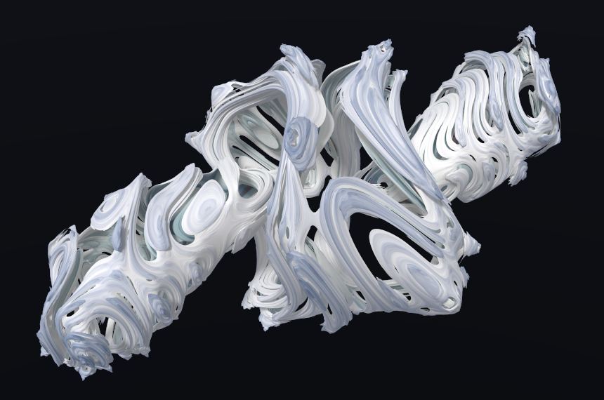

# Bristorbrot

**Website: [bristorbrot.org](https://bristorbrot.org)**: the project home, with the algebra explained and a gallery.

Explore quadratic and cubic fractals in **Bristorian algebra**, and compare them with quaternion
fractals. Bristorian numbers, called **imordials**, have ranked imaginary units. Their multiplication
depends on both operand order and brackets: `(zz)z` and `z(zz)` can give different answers.



*b_brot Julia set, `z² + c`, at C = (−0.7, −0.35, 0.05, 0), β = 27°.
Rendered by the shipped v3 player with 64 refinement samples, sampled area-light shadows and edge smoothing; not retouched.*

## Try the viewer

From the repository root, start any static web server. For example, with Python 3:

```sh
python3 -m http.server 8000
```

Open [brot_viewer v3](http://localhost:8000/packs/brot_viewer/v3/) in a browser with WebGL2.
The built player is self-contained; running it needs no build step or CodeT source tree.

- Choose **Formula** to compare b_brot (`z² + c`), the two chi_brot cubes (`(zz)z + c` and
  `z(zz) + c`), and the quaternion maps `q² + c` and `q³ + c`.
- Switch **Variant** between Mandelbrot and Julia. In Julia mode, **Pick C** opens the matching
  parameter slice; for chi_brot, **both brackets** highlights their finite escape-time differences.
- Drag to orbit, shift-drag to spin the body, and use the wheel to zoom. Let the view settle to
  accumulate refinement samples. **Copy link** saves the current view in a URL.

## What the algebra changes

Imordials use the familiar `i`, `j`, `k` symbols, but multiply by a different rule. For any number
`n` of imaginary units, with `1` as the identity and multiplication extended bilinearly:

```text
e_a · e_a = −1
e_a · e_b = sgn(b − a) · e_b    (a ≠ b)
```

The product returns a signed copy of its right-hand factor. In rank order, `i·j = j` and
`j·i = −i`. Arrays use `(real, e1, e2, …)`; the viewer uses `(real, i, j, k)` and displays
three-dimensional sections of the four-dimensional iteration.

With two or more imaginary units, the algebra has all three structural defects: it is
non-commutative, non-associative and non-alternative. Quaternions have only the first; octonions
stop before the third. These are exact properties of the rule. For example, even a repeated factor
does not restore associativity: `(i·i)·j = −j`, while `i·(i·j) = j`.
The cubic maps differ too: at `z = i + j`, `(zz)z = −3i − 3j`, while `z(zz) = −i − j`.
The Euclidean norm is not multiplicative in general: this same `z` has `|z|² = 2`, but `|z²| = √6`.

Reversing multiplication gives the **opposite algebra**, `a ∘ b = b · a`. It has exactly the
same squares, so a `z² + c` image cannot distinguish the two products; general products and
cubic brackets can. See [The square cannot see the hand; the product can](packs/de_ray/v1/atoms/conv.hand.md).

The algebra extends beyond four dimensions. The bundled viewer renders four-dimensional maps;
JavaScript and Python in `bristor_product` support arbitrary `n`. The rendered surfaces use
finite iteration budgets and heuristic distance estimates, not certified distances to the infinite
fractal boundary. Still refinement samples the light and pixels; it does not certify the geometry.

## Reuse the code

- **[`core/`](core/README.md)** contains the Bristorian product and cubic maps, quaternion comparison
  maps, a distance-estimate ray marcher, shadows, edge smoothing and C pickers. Each block has
  JavaScript, Python and/or GLSL implementations with its own conformance checks.
- **`viewers/brot_viewer/`** contains the viewer's controls, camera and rendering glue. Its algebra
  and rendering blocks come from `core/`; `packs/brot_viewer/v3/` freezes the copies used by this release.

## How it is assembled and checked

The algebra and rendering blocks are copied unchanged from **CodeT**, the project's reusable code
library. Story packs similarly assemble text atoms. A build runs each block's conformance checks
against the copy that will ship. Viewer checks must pass as shipped and fail with every declared
fault switched on. These checks establish the tested behavior; they are not a proof of every
rendered pixel or every possible input.

Fix a reusable block in its source and rebuild, rather than patching a generated copy. Viewer glue,
file I/O, manifests and build tooling are ordinary code.

```text
core/                          reusable blocks; rebuilt in place
    README.md                  block descriptions and check commands
    <block>/                   implementations, reference data and conformance scripts
core.json                      block selection and descriptions for core/
viewers/<name>/                viewer glue: viewer.json, index.html, *.js, *.glsl
packs/<name>/<version>/        frozen, self-contained build
    manifest.json              file hashes, conformance results, checks and licences
    code/<block>/              block copies used by this build
    atoms/*.md                 text atoms (story packs only)
tools/build_pack.py            assembles core/ and packs
tools/check_viewer.mjs         runs a viewer's checks headlessly, including its fault switches
```

Included packs:

- **`packs/brot_viewer/v3/`**: quadratic and cubic Bristorian and quaternion fractals, with movable
  light, sampled area-light shadows, body spin, edge smoothing and mist (2026-10-04).
- **`packs/de_ray/v1/`**: steps 0–1 of *The life of one ray*: the number system, its square and
  Jacobian, and the product they use.

## Build from the source tree

Rebuilding requires the sibling CodeT source tree; story builds also require the story atoms and
their lint tool. These are not included in this repository. The shipped conformance scripts can
run independently; Python checks need Python 3, JavaScript checks use Node.js 22.7 or later, and GPU/viewer
checks also need Playwright and a WebGL2-capable Chrome or Chromium. See [the core check commands](core/README.md#checking-a-block).

```sh
python3 tools/build_pack.py --core
python3 tools/build_pack.py --viewer brot_viewer --version v4
python3 tools/build_pack.py de_ray --steps 0-1 --version v2
```

Add `--dry-run` to check temporary copies without installing outputs. A build installs its output
only after all required checks pass. It fails if:

- a block's conformance check or declared self-test fails;
- a block contains an unclassified file, or a required block is missing;
- a viewer's relative import resolves outside the pack, its check fails as shipped, or a declared
  fault is not detected;
- a viewer uses a block absent from `core.json` (when building `core/`);
- the leak scan finds internal paths or ledger text in the generated output;
- a story's step table disagrees with its atoms, an atom depends on one outside the selected steps,
  convention stamps disagree, or text lint fails.

Existing pack versions are never overwritten; use a new version for a new build.

## Licence

Code is MIT; see [`LICENSE`](LICENSE). Test vectors and other data files are
[CC0 1.0](https://creativecommons.org/publicdomain/zero/1.0/). Story atoms and other prose `.md`
files are [CC BY 4.0](https://creativecommons.org/licenses/by/4.0/).

Attribution is requested for code and data, and required for text:
“Bristorbrot / Doug Bristor, [bristorbrot.org](https://bristorbrot.org)”.
Keep the MIT copyright and licence notices when redistributing code. For text, give appropriate
credit, link to CC BY 4.0 and indicate any changes.
